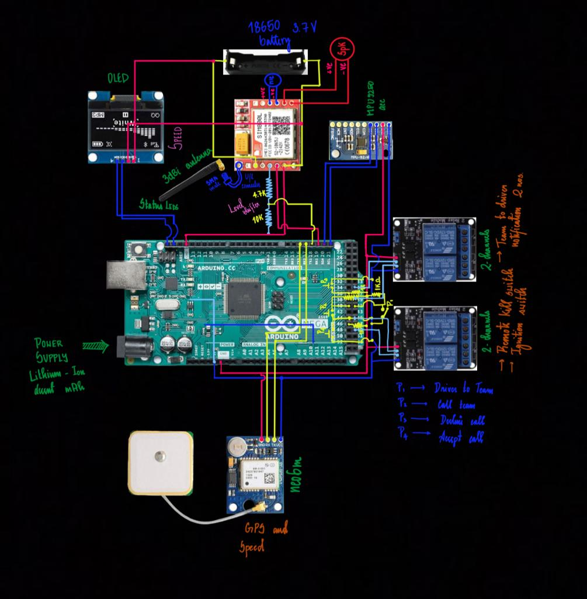
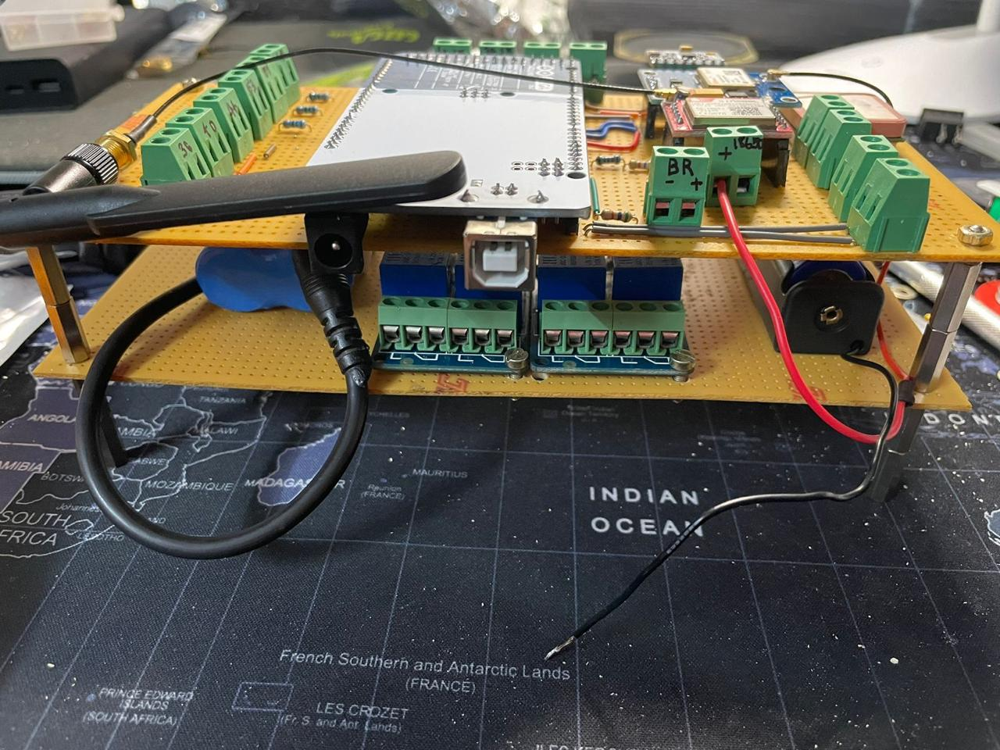
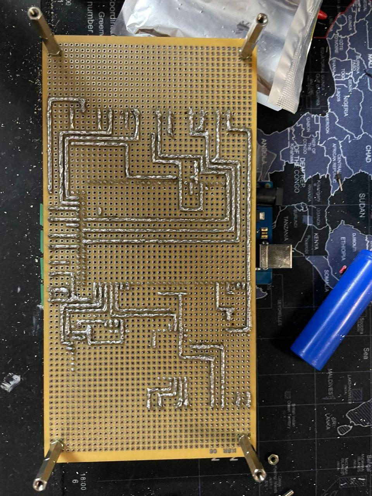
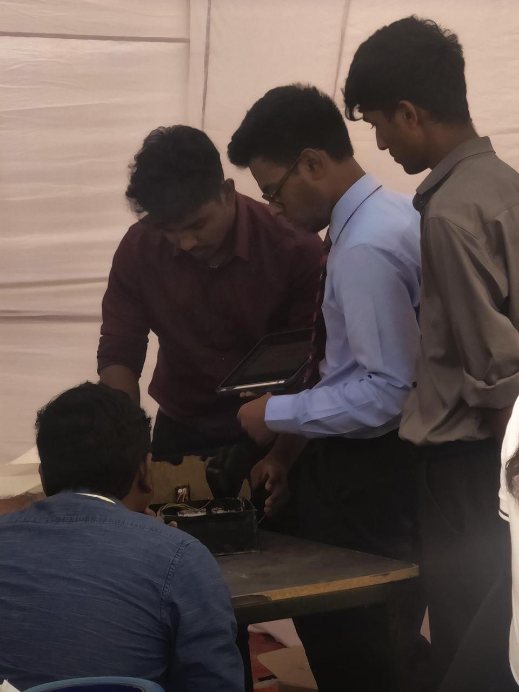
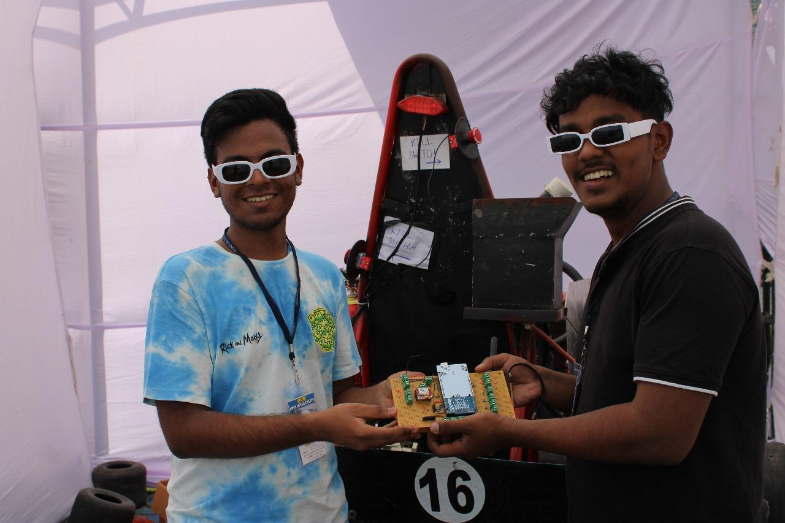

# Apex-Racing
Innovation sub-domain of Apex Racing Team, a SAE collegiate club based at SSN College of engineering.

## Circuit Assembly Version 1

### Circuit Layout Diagram:

---

### Circuit Post Assembly:

#### Overall view of our assembly work

#### Soldering work for the internal circuit connections

---

### Us at Greater Noida, Delhi, Buddh International Circuit
#### Presenting our work to the jury where the circuit is housed in a acrylic enclosure

#### Us with the kart

